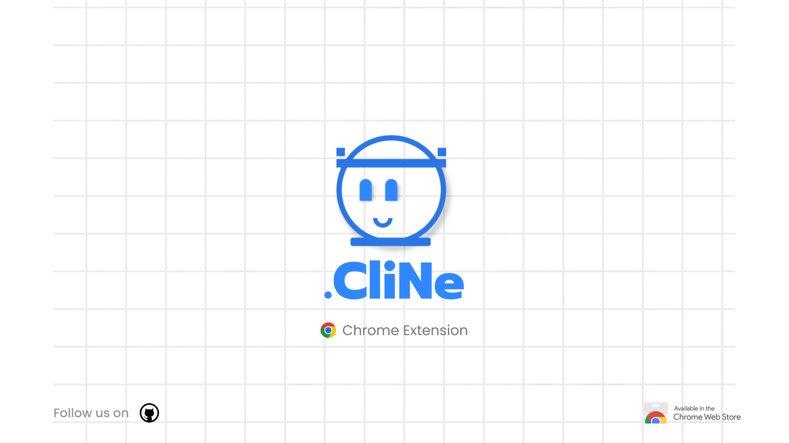
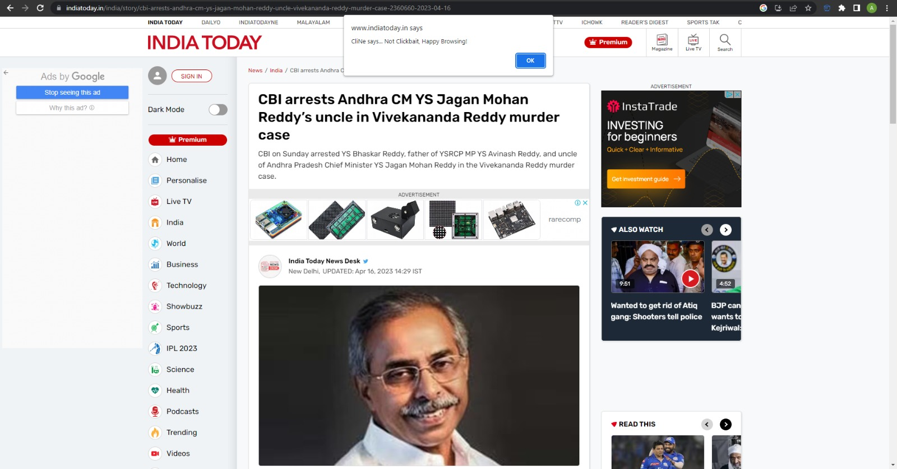
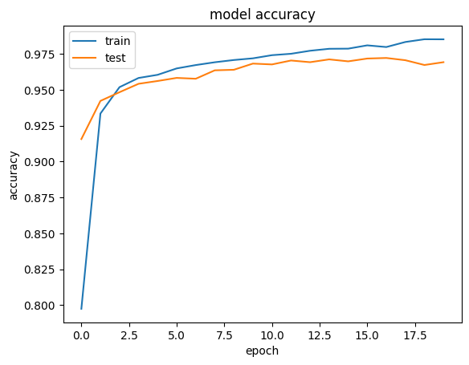
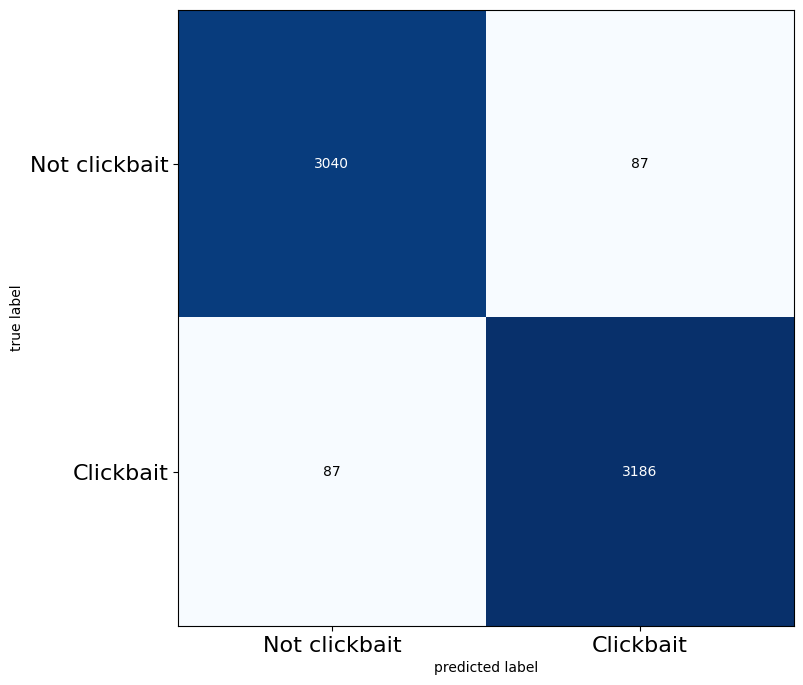

# CliNe — Clickbait News Detector

**Chrome extension + LSTM API** that scores news headlines for clickbait in real time.

Recovered and rebuilt after Git LFS assets were lost on the original repo — working model weights, API, and Manifest V3 extension are in-tree again.

[](https://www.python.org/)
[](https://www.tensorflow.org/)
[](https://developer.chrome.com/docs/extensions/mv3/)
[](LICENSE)



## What it does

1. **LSTM classifier** (Keras) tokenizes a headline and outputs a clickbait probability  
2. **Flask API** exposes `POST /predict` for the extension (and curl / other clients)  
3. **Chrome extension** reads the page `h1` / headline and shows the score in the popup  



### Model snapshot

| Metric | Notes |
|--------|--------|
| Architecture | LSTM + embedding over padded title sequences (`maxlen=20`) |
| Serving | Saved Keras model + tokenizer pickle under `api/models/` |
| Threshold | Default `0.5` (override with `CLICKBAIT_THRESHOLD`) |




## Quick start

### 1. API

Requires **Python 3.10 or 3.11** (TensorFlow 2.15 wheels).

```bash
cd api
python3.11 -m venv .venv
source .venv/bin/activate   # Windows: .venv\Scripts\activate
pip install -r requirements.txt
python app.py
```

API listens on **http://127.0.0.1:10000**

```bash
curl -s http://127.0.0.1:10000/health
curl -s -X POST http://127.0.0.1:10000/predict \
  -H 'Content-Type: application/json' \
  -d '{"text":"You Won'\''t Believe What Happened Next"}'
```

Example response:

```json
{
  "label": "clickbait",
  "score": 0.91,
  "threshold": 0.5,
  "text": "You Won't Believe What Happened Next"
}
```

### 2. Chrome extension

1. Open `chrome://extensions` → enable **Developer mode**  
2. **Load unpacked** → select the `extension/` folder  
3. Open a news article → click the CliNe icon → **Enable** → **Scan this page**  

The extension talks to `http://127.0.0.1:10000/predict` (change via `chrome.storage.sync.apiUrl` if needed).

## Project layout

```
api/
  app.py              # Flask predict + health
  requirements.txt
  models/             # Keras model, weights, tokenizer
extension/            # Manifest V3 Chrome extension
docs/images/          # Banner, UI shot, training plots
```

## Notes

- Original public clone only had **broken Git LFS pointers**; runtime assets were restored from the sibling `CliNe_API` / extension sources and cleaned up here.  
- Heavy GloVe dumps and university PDF write-ups were dropped so the repo stays cloneable.  
- Team project origins: Kishan Munjpara, Janakar Patel, Abhi Prajapati.

## License

MIT — see [LICENSE](LICENSE)
